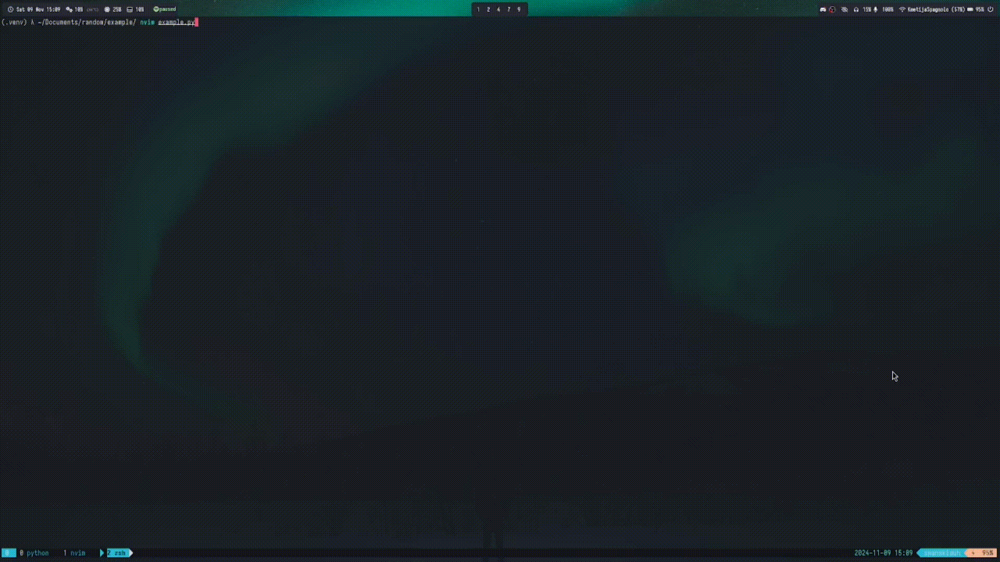

# pynvim-runner

A simple Neovim plugin to run Python code in a terminal split, enabling you to interact with a Python REPL directly within Neovim. 
Run Neovim in your custom Python environment to have all packages available.


## Installation
Use with packer.nvim:

```lua
use {
    'spagnoloG/pynvim-runner',
    config = function()
        require('pynvim-runner').setup({
            shell_cmd = "python3",  -- Set the shell command to use
            terminal_width = 90,  -- Custom width for terminal window
            auto_scroll =  true,  -- Enable auto-scroll
            mappings = {
                open_shell = "<leader>to",      -- Remap open shell to <leader>to
                run_selection = "<leader>ts",   -- Remap run selection to <leader>ts
                toggle_terminal = "<leader>tt", -- Remap toggle width to <leader>tt
            }
        })
    end
}
```

## Keybindings

| Mapping       | Action Description                |
|---------------|-----------------------------------|
| `<leader>to`  | Open terminal shell               |
| `<leader>ts`  | Run selected code in visual mode  |
| `<leader>tt`  | Toggle the terminal window        |

## Example usage

